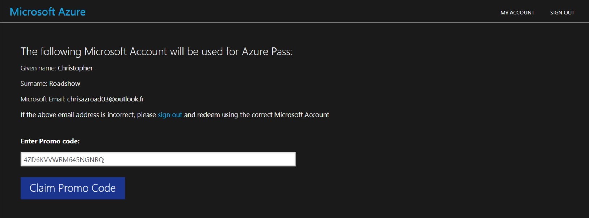
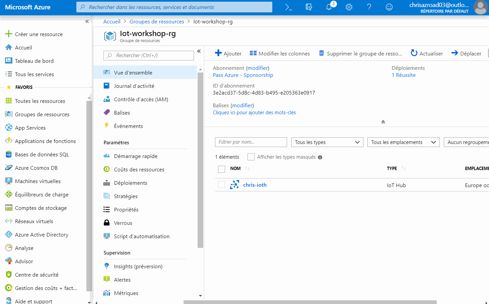
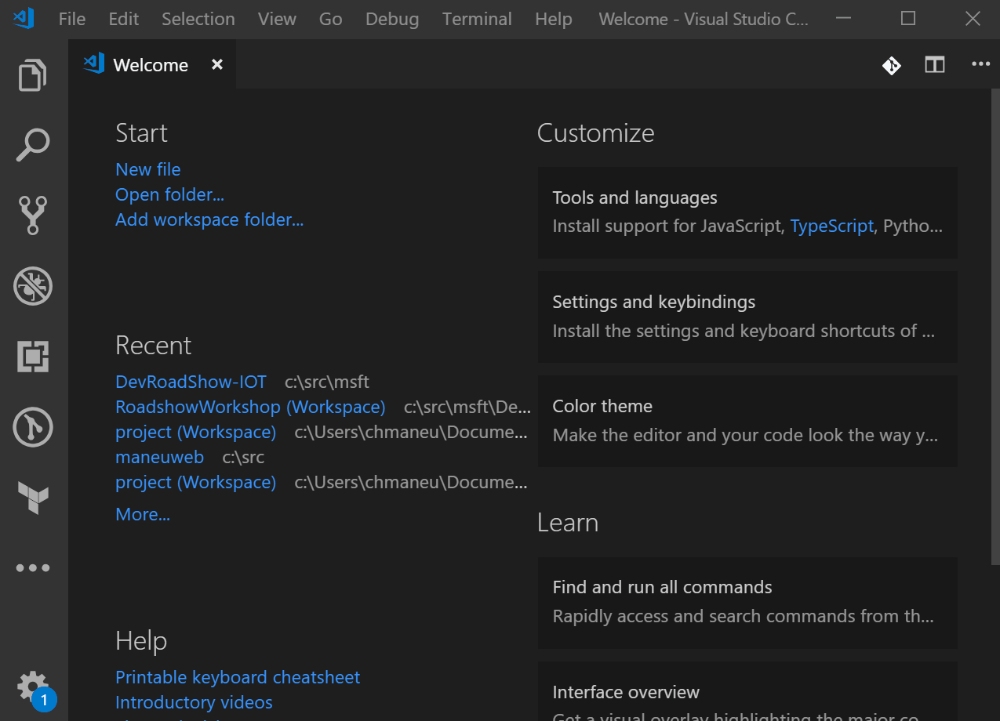

# Microsoft France Dev Roadshow - Atelier IoT

Ce repository contient le code ainsi que les instructions vous permettant de 
réaliser le workshop _codez votre premier projet IoT_ lors du 
[RoadShow développeurs Microsoft France][roadshow-twitter].

- [Objectif du workshop](#objectif-du-workshop)
- [Préparez votre environnement](#objectif-du-workshop)
- [Configurez votre board](#objectif-du-workshop)
- [Créer vos services Azure](#objectif-du-workshop)
- [Déployez du code sur votre board et connectez-là à Azure](#objectif-du-workshop)
- [Déployez votre fonction dans Azure](#objectif-du-workshop)
- [Déployez votre interface utilisateur dans Azure](#objectif-du-workshop)
- [Ajoutez le support du changement de couleur de la LED](#objectif-du-workshop)
- [[Etape Bonus] Changez à distance le message](#objectif-du-workshop)
- [[Etape cachée] Envoyez un dessin à distance](#test)

## Objectif du workshop

Ce workshop, accessible à **tous les développeurs même sans connaissance en IoT ou sur Azure -**, vous permettra de 
découvrir la programmation sur des devices IoT avec [Arduino][arduino] et [Visual Studio Code][vscode-home], ainsi que 
la création d'expériences connectées avec les services [Azure][azure-home].

## Préparez votre environnement

Afin de réaliser ce workshop, vous aurez besoin: 

- D'un PC (ou Mac) de développement, sur lequel il faudra installer un certain nombre d'outils et de drivers,
- D'un abonnement Azure (d'essai, payant ou MSDN),
- Dans l'idéal, d'une carte de développement [MXChip][mxchip] ([acheter][mxchip-buy]), ou de l'émulateur.

### Préparer sa machine de dev

Afin de pouvoir développer, puis déployer à la fois sur le board MXChip et sur Azure, il vous faudra plusieurs outils
(gratuits): 

- [Visual Studio Code][vscode-home] ainsi que quelques extensions
    - L'extension [Azure IoT tools][vscode-iottoolsext], qui contient notamment _IoT Workbench_,
    - L'extension [Arduino][vscode-arduinoext] de l'éditeur Microsoft,
    - L'extension [Azure][vscode-azureext],
    - Les extensions pour les langages que vous allez utiliser
        - [C#][vscode-csharpext],
        - JavaScript est déjà inclus :)
- [Arduino IDE][arduino-ide]: il contient les outils de builds et de déploiment pour la carte MXChip. **Attention:** Installez la version "standalone", et non pas la version du Store.
- Le driver _ST-Link_: 
	* Windows
	Télécharger et installer le driver depuis le site [STMicro](http://www.st.com/en/development-tools/stsw-link009.html).

	* macOS
	Pas de driver nécessaire

	* Ubuntu
  	Exécuter la commande suivante dans votre terminal, puis déconnectez/reconnectez-vous afin d'appliquer le changement 
    de permissions

		```bash
		# Copy the default rules. This grants permission to the group 'plugdev'
		sudo cp ~/.arduino15/packages/AZ3166/tools/openocd/0.10.0/linux/contrib/60-openocd.rules /etc/udev/rules.d/
		sudo udevadm control --reload-rules
		
		# Add yourself to the group 'plugdev'
		# Logout and log back in for the group to take effect
		sudo usermod -a -G plugdev $(whoami)
		```

L'installation d'une extension Visual Studio peut se faire par ligne de commande, ou directement dans l'interface via 
l'onglet "extensions" (le 5ème icône sur la gauche).


Si vous souhaitez installer l'ensemble des extensions, voici un script pour Windows: 
```
code --install-extension vsciot-vscode.azure-iot-tools
code --install-extension vsciot-vscode.vscode-arduino
code --install-extension ms-vscode.vscode-node-azure-pack
code --install-extension ms-vscode.csharp
```

Une fois l'ensemble de ces composants installés, il faudra s'assurer que Visual Studio Code puisse utiliser l'installation
d'Arduino. Ouvrir **File > Preference > Settings** et ajouter les lignes suivantes à votre configuration.


Voici les valeurs par défaut à ajouter à cette configuration:

* Windows

    ```JSON
    "arduino.path": "C:\\Program Files (x86)\\Arduino",
    "arduino.additionalUrls": "https://raw.githubusercontent.com/VSChina/azureiotdevkit_tools/master/package_azureboard_index.json"
    ```

* macOS

    ```JSON
    "arduino.path": "/Applications",
    "arduino.additionalUrls": "https://raw.githubusercontent.com/VSChina/azureiotdevkit_tools/master/package_azureboard_index.json"
    ```

* Ubuntu

    ```JSON
    "arduino.path": "/home/{username}/Downloads/arduino-1.8.5",
    "arduino.additionalUrls": "https://raw.githubusercontent.com/VSChina/azureiotdevkit_tools/master/package_azureboard_index.json"
	```

**Pensez à sauvegarder vos paramètres avant de passer à l'étape suivante !**

Enfin il faudra ajouter le SDK spécifique pour la board Arduino MXChip. Pour cela, via la palette de commande (`Ctrl+Shift+P`
 ou `Cmd+Shif+P`), ouvrir la page **Arduino: Board Manager**, et rechercher **AZ3166**, puis installer la dernière version.


### Préparer son environnement Azure

Afin de réaliser cet atelier, vous aurez besoin d'une souscription Azure. Il y a plusieurs moyens d'en obtenir une: 

- Créer un [abonnement d'essai][azure-free-trial],
- Si vous lisez cet atelier durant le Roadshow, vous pouvez utiliser l'Azure Pass que nous vous fournissons,
- Ou si vous êtes abonnés MSDN, utiliser les crédits offerts par votre abonnement.

#### Utiliser votre Azure Pass

1. Rendez-vous sur [microsoftazurepass.com][azurepass] et cliquez sur **Start**,

2. Connectez vous avec un compte Microsoft Live **Vous devez utiliser un compte Microsoft qui n'est associé à aucune
 autre souscription Azure**
3. Vérifiez l'email du compte utilisé et cliquez sur **Confirm Microsoft Account**

4. Entrez le code que nous vous avons communiqués, puis cliquez sur **Claim Promo Code** (et non, le code présent sur la
 capture d'écran n'est pas valide ;) ),

5. Nous validons votre compte, cela prend quelques secondes

6. Nous serez ensuite redirigé vers une dernière page d'inscrption. Remplissez les informations, puis cliquez sur **Suivant**

7. Il ne vous restera plus que la partie légale: accepter les différents contrats et déclarations. Cochez les cases que 
vous acceptez, et si c'est possible, cliquez sur le bouton **Inscription**


Encore quelques minutes d'attente, et voilà, votre compte est créé ! Prenez quelques minutes afin d'effectuer la 
visite et de vous familiariser avec l'interface du portail Azure.


## Configurez votre board

Votre board est normalement déjà configurée. Si vous deviez la reconnecter au WiFi, vous trouverez
[les instructions ici](docs/configurer-wifi.md).

A compléter
- Connecter au WiFi
- Choisir le port COM dans VSC
- Utiliser l'émualteur

## Créer vos services (ressources) dans Azure

Nous allons maintenant utiliser le [portail Azure][azure-portal] afin de créer l'ensemble des services dans Azure - 
appelée _ressources_. Si vous êtes plus bash que clic, vous pouvez utiliser la [Azure CLI][docs-azcli] (on vous laisse 
chercher comment faire ;). 

### Créer un resource group

Nous allons commencer par créer un groupe de ressources (_resource group_). C'est un conteneur logique pour l'ensemble 
des services que vous allez créer ensuite. Chaque service doit absolument être dans un resource group.

Depuis le portail Azure, vous avez trois moyens de créer une nouvelle ressource : 

- Le bouton **Créer une ressource** en haut à gauche,
- Naviguer vers un type de service, puis cliquer sur le bouton **Ajouter**
- Depuis la page du groupe de ressources, cliquer sur le bouton **Ajouter**

La vidéo suivante vous montre comment créer votre premier groupe de ressources. Le nom du groupe de ressource doit être 
unique au sein de votre compte Azure. Pour ce qui est de la région, nous choisirons tout au long de cet atelier _Europe 
Occidentale_ ou _West Europe_.


Une fois créé, vous pouvez vous rendre sur la page de la ressource via l'icône de notifications en haut.

### Créer un IoT Hub

L'IoT Hub est un service qui vous permet de gérer la connexion entre vos devices IoT et vos services hébergés sur Azure 
(ou ailleurs). Plus concrètement, il vous permet : 

- D'identifier et de recevoir des données de vos périphériques IoT - on appelle cela le _Device To Cloud_,
- D'envoyer ces données à différents applicatifs,
- De transmettre des commandes ou des données du cloud vers vos périphériques - c'est le _Cloud To _Device_, 
- De mettre à jour les micrologiciels à distance de vos périphériques, voire de déployer du code à distance.

La vidéo suivante nous montre comment créer un nouveau IoT Hub. Choisissez bien le groupe de ressources créé à l'étape 
précédente, puis choisissez la région (Europe occidentale) puis un nom.

> Comme beaucoup de ressources dans Azure, leur nom devient une partie d'une adresse Internet - ici 
`monhub.chris-ioth.azure-devices.net`. Il doit donc être unique à tous les utilisateurs d'Azure !

A l'étape d'après, vous serez amené à choisir un niveau de tarification (_tier_) et une mise à l'échelle. Pour cet 
atelier, nous choisirons la taille **S1: Niveau Standard**.

> Il existe à aujourd'hui trois tiers. Le tiers gratuit est limité en nombre de messages, alors que le tiers basique ne 
dispose pas des fonctionnalités _Cloud to Device_ ou _Device Twins_ que nous allons utiliser plus loin. Le nombre 
d'unités permet quand à lui de supporter un plus grand nombre de périphériques IoT.


### Créer un IoT Device

Au sein du IoT Hub, chacun de vos périphériques IoT se doit d'être déclaré afin de pouvoir le gérer et accepter des 
données. Pour cet atelier simple, nous allons ajouter le périphérique à la main. Si nous avions à déployer des milliers 
de périphériques, il y a bien évidemment [une solution][docs-deviceprov] :)

La création d'un device IoT dans le portail est assez simple. Naviguez jusqu'à l'onglet **Appareils IoT**, puis cliquez 
sur **Ajouter**. Vous avez alors simplement à donner un nom à votre périphérique.


Lorsque vous vous rendez sur l'écran de votre appareil IoT, vuos verrez alors deux clés : **Ce sont elles qui permettent 
de sécuriser la connexion entre votre appareil et Azure**. Il est important **de ne pas les diffuser ou les mettre dans 
votre code source (ou repository Github)**. Nous verrons plus tard comment la déployer sur la carte.

> **Notez cette clé d'accès quelque part** ou gardez la fenêtre ouverte, nous allons l'utiliser dans quelques étapes.

Nous en avons pour l'instant fini avec IoT Hub, mais nous reviendrons plus tard sur cette partie.

### Créer un App Service pour son site web

Nous allons plus tard réaliser une application web afin de piloter notre carte à distance. Pour l'héberger, le plus 
simple est de créer une *Web App**. Ce service se charge pour vous de déployer un site web, ainsi que le langage que 
vous utilisez: PHP, Ruby, Python, NodeJS, .Net ou Java. Il ne vous reste plus qu'à déployer votre code.*

Lors de l'étape de création, pensez bien à sélectionner un site



> Lors de cette application, nous allons automatiquement créer un _App Service Plan_, c'est l'infrastructure qui 
hébergera votre site. Tout comme il existe des "plans" côté IoT Hub, il y en a pour les App Services, et l'un d'entre 
eux est gratuit. Il n'est pas sélectionné par défaut, mais vous pouvez le personnaliser et ainsi héberger un petit site 
pour vos prototypes entièrement gratuitement ;)

### Créer une Azure Function

Notre site web sera simplement un "Front HTML". Il lui faudra communiquer avec l'IoT Hub, et pour cela utiliser un
 _secret_. Afin de protéger ce secret et de limiter ce qu'il est possible de faire, nous allons créer une API contenant 
 cette logique et ce secret. Nous pourrions l'héberger dans un site web - comme celui que nous avons créé il y a 
 quelques instants - mais Azure Functions est un service intéressant pour cet usage : il vous permet d'héberger non pas 
 un site web, mais simplement une méthode de code !

Lors de la création, il vous faudra indiquer un nom et un emplacement. Hormis ces informations et le groupe de 
ressources, laissez tous les autres paramètres à leurs valeurs par défaut.


## Déployez du code sur votre board et connectez-là à Azure

Si vous avez installés tous les prérequis, et que votre board est [connectée à Internet](docs/configurer-wifi.md), alors
 nous pouvons continuer. Notre première étape est de créer un projet **Azure IoT Workbench Visual Studio Code**. Ce type de projet va nous apporter toutes les fonctionnalités nécessaires pour travailler: builder le code, configurer la carte, déployer le code sur la carte, etc...

 Dans la suite de cet atelier, nous allons utiliser beaucoup de commandes. Celles-ci sont accessibles via le raccourci clavier `Ctrl+Shift+P` (ou `Cmd+Shift+P` sous Mac). Pour créer votre projet: 
 
 1. Recherchez `Workbench create`, et choisissez `Azure IoT Device Workbench: Create Project`
 2. Sélectionnez `IoT DevKit`
 3. Selectionnez le template `With Azure IoT Hub`
 4. Choisissez un dossier dans lequel enregistrer vos fichiers sources

> Nous allons créer plusieurs projets lors de cet atelier. Je vous suggère la hiérarchie de dossiers suivante : 
> ```
> MonProjet
>  | - device
>  | - fonction
>  | - web
> ```
> 



Nous pouvons désormais copier-coller le contenu du fichier `.ino` de ce GitHub dans votre projet. A cette étape, il est possible de compiler le code avec la commande `Azure IoT Device Workbench: Compile Device Code`.

Il nous reste désormais deux choses à faire: connecter la board à notre IoT Hub, et déployer le code sur le device. Pour la connection, nous allons simplement envoyer la chaîne de connexion - créée au début du tutoriel - sur la board. Au préalable, assurez-vous que Visual Studio a bien sélectionné votre type de board ainsi que le port série (émulé via l'USB).


1. Maintenez appuyé le bouton **A** puis appuyez et relâchez le bouton **reset** pour passer en mode configuration
2. A l'aide de la commande `Azure IoT Device Workbench: Configure Device Settings`, choisissez `Config Device Connection String`, puis `Input IoT Hub Device Connection String`, et collez la connection string complète générée au début de l'atelier.

Nous pouvons maintenant déployer notre code. Toujours à l'aide de la commande de palettes, sélectionnez `Azure IoT Device Workbench: Upload Device Code`.
L'opération peut prendre quelques minutes. Pendant ce temps-là, la LED "programming" sur la board devrait clignoter. 

> **Vous n'avez pas de MXChip sous la main et vous voulez tout de même tester cela ?**
> C'est possible, avec [l'émulateur][mx-emulator] ! Copiez-collez le code Arduino dans l'émulateur, indiquez votre 
>chaîne de connexion à l'IoT Hub et c'est parti.

## Créer une interface utilisateur 

Nous l'avons déjà fait pour vous :). 
> Dans une prochaine version de l'atelier, nous proposerons la création d'une interface utilisateur depuis le début.

### Créer une Azure Function pour communiquer avec IoT Hub

1. Lancez la commande **Azure Functions: Create new project**,
2. Sélectionnez un répertoire,
3. Choisissez le langage C#,
4. Sélectionnez la runtime **Azure Functions v2**
5. Ajoutez le projet a votre workspace courant

> Si vous êtes plus à l'aise avec Python ou avec NodeJS, vous devriez pouvoir porter le code avec les SDKs correspondants. Mais dites-le nous avant de vous lancer!

Vous pouvez maintenant copier le code C# de ce repository GitHub dans votre dossier de travail.

Dans le fichier `State.cs`, à la ligne 22, il vous faudra remplacer la référence _ChrisMX_ par celle du nom du device IoT créé au début de l'atelier.

Enfin pour déployer le code de votre fonction, faites un clic-droit sur le dossier de votre projet fonction, et cliquez sur **Deploy to Function App**. Vous pourrez alors choisir la souscription, puis l'application fonction que vous aviez créé tout au début. 

Il vous restera une dernière petite chose : faire communiquer votre Azure Function avec l'IoT Hub. Pour se faire, vous devez indiquer la chaîne de connexion à l'IoT Hub à la fonction. Nous allons passer par une variable d'environnement `iotHubConnectionString`, qui est lue par la méthode `Environment.GetEnvironmentVariable`. Nous pouvons faire cela directement via le portail Azure.


### Le moment de vérité !

Lancez le fichier index.html qui est dans le dossier `src/web`, puis indiquez le nom de votre IoT Hub. 
Si tout se passe bien, vous devriez voir le status de votre carte, et en cliquant sur le bouton "RGB LED", la LED de votre carte devrait s'allumer !

## Ajoutez le support du changement de couleur de la LED

Maintenant que votre projet fonctionne, et que vous pouvez allumer et éteindre la LED à distance, essayons d'ajouter 
un peu de disco ! Nous allons maintenant faire en sorte de pouvoir choisir la couleur de la LED RGB. Jusqu'à présent,
le code permet uniquement de sélectionner les tons de rouge. Il faut donc compléter le code pour supporter le vert et 
le bleu.

Pour réaliser cela, il vous faudra retrouver les `TODO` dans le code dans les deux fichiers suivants: 

- Dans le fichier `State.cs`
- Dans le fichier `main.js`

On vous laisse trouver ce qu'il faut changer dans le code.

N'hésitez pas à nous appeler à l'aide en cas de soucis !

## [Etape Bonus] Changez à distance le message

Regardez donc la méthode `DeviceMethodCallback`, c'est elle qui est appelée quand le device reçoit un message du cloud.


## [Etape cachée] Envoyez un dessin à distance

Le MXChip est équipé d'un écran LCD de 128x64px qui est capable d'afficher des dessins sommaires. Avant de tenter un envoi à distance, 
essayer de l'afficher en modifiant le code du projet Arduino. Pour vous aider, le site [pixelcraft][pixelcraft] vous 
permet de générer le code correspondant à votre dessin.

La méthode `Screen.draw` vous permet de dessiner cette matrice à l'écran.
Enfin, il vous faudra envoyer en JSON ce dessin depuis l'IoT Hub, et décrypter le JSON sur l'arduino. Pour tout cela, 
il vous faudra probablement les include suivants: 

```cpp
#include "RGB_LED.h"
#include <ArduinoJson.h>
```

## [Premier de la classe] Testez l'un des autres projets

La commande **Azure IoT Device Workbench: Open Examples** vous permet d'accéder à un ensemble d'exemples préassemblés. Testez-en un, comme par exemple le _DevKit Translator_.


[roadshow-twitter]: https://twitter.com/cmaneu/status/1102847594508832768
[arduino]: https://www.arduino.cc
[vscode-home]: https://code.visualstudio.com/?wt.mc_id=devroadshowiot-github-chmaneu
[azure-home]: https://azure.microsoft.com/fr-fr/?wt.mc_id=devroadshowiot-github-chmaneu
[mxchip]: https://aka.ms/iot-devkit?wt.mc_id=devroadshowiot-github-chmaneu
[mxchip-buy]: https://aka.ms/iot-devkit-purchase?wt.mc_id=devroadshowiot-github-chmaneu
[vscode-iottoolsext]: https://marketplace.visualstudio.com/items?itemName=vsciot-vscode.azure-iot-tools&wt.mc_id=devroadshowiot-github-chmaneu
[vscode-arduinoext]: https://marketplace.visualstudio.com/items?itemName=vsciot-vscode.vscode-arduino&wt.mc_id=devroadshowiot-github-chmaneu
[vscode-azureext]: https://marketplace.visualstudio.com/items?itemName=ms-vscode.vscode-node-azure-pack&wt.mc_id=devroadshowiot-github-chmaneu
[vscode-csharpext]: https://marketplace.visualstudio.com/items?itemName=ms-vscode.csharp&wt.mc_id=devroadshowiot-github-chmaneu
[arduino-ide]: https://www.arduino.cc/en/Main/Software
[azurepass]: https://www.microsoftazurepass.com/?wt.mc_id=devroadshowiot-github-chmaneu
[azure-portal]: https://portal.azure.com/?feature.customportal=false&wt.mc_id=devroadshowiot-github-chmaneu
[azure-free-trial]: https://azure.microsoft.com/en-us/free/?wt.mc_id=devroadshowiot-github-chmaneu
[docs-azcli]: https://docs.microsoft.com/fr-fr/cli/azure/?view=azure-cli-latest&wt.mc_id=devroadshowiot-github-chmaneu
[docs-deviceprov]: https://docs.microsoft.com/fr-fr/azure/iot-dps/?wt.mc_id=devroadshowiot-github-chmaneu
[mx-emulator]: https://azure-samples.github.io/iot-devkit-web-simulator/?wt.mc_id=devroadshowiot-github-chmaneu
[pixelcraft]: https://pixelcraft.cc/
