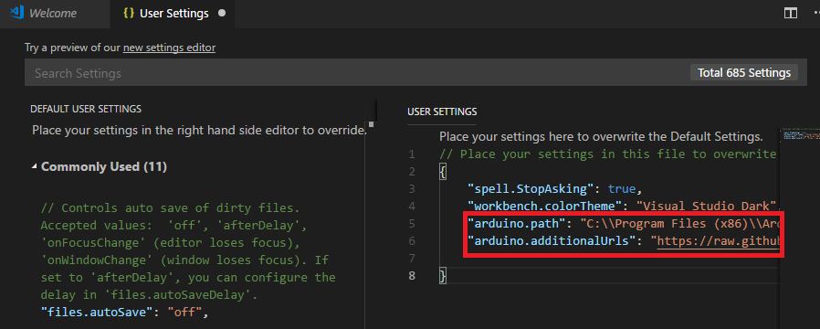
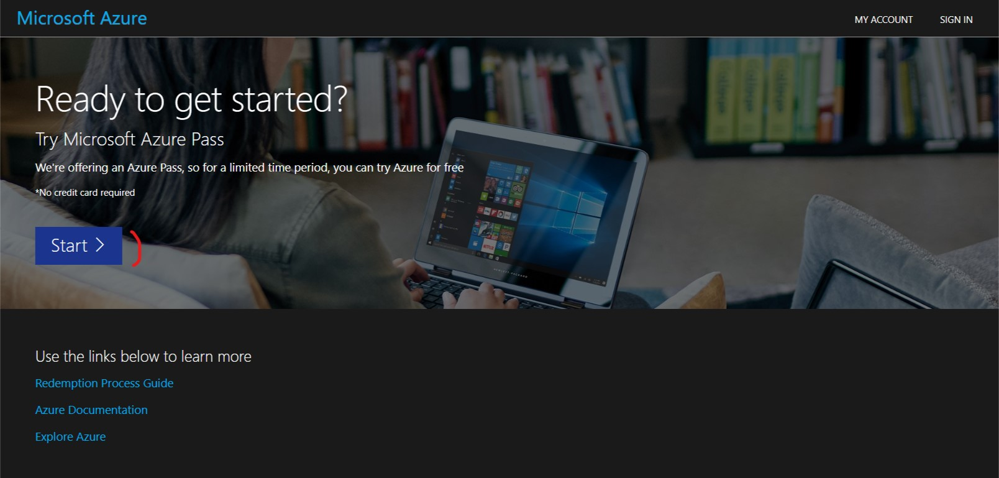
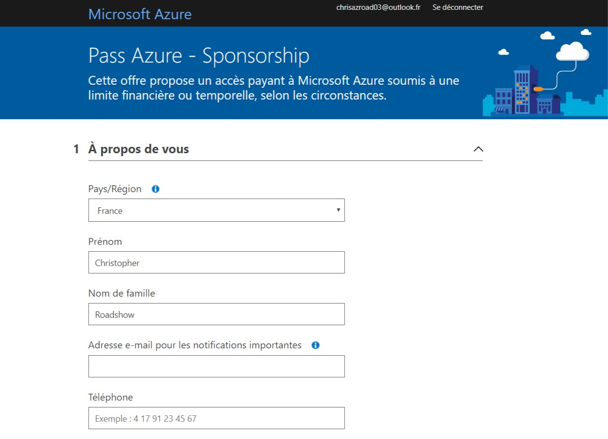

# Microsoft France Dev Roadshow - Atelier IoT

Ce repository contient le code ainsi que les instructions vous permettant de 
réaliser le workshop _codez votre premier projet IoT_ lors du 
[RoadShow développeurs Microsoft France][roadshow-twitter].

- [Objectif du workshop](#objectif-du-workshop)
- [Préparez votre environnement](#objectif-du-workshop)
- [Configurez votre board](#objectif-du-workshop)
- [Créer vos services Azure](#objectif-du-workshop)
- [Déployez du code sur votre board et connectez-là à Azure](#objectif-du-workshop)
- [Déployez votre fonction dans Azure](#objectif-du-workshop)
- [Déployez votre interface utilisateur dans Azure](#objectif-du-workshop)
- [Ajoutez le support du changement de couleur de la LED](#objectif-du-workshop)
- [[Etape Bonus] Changez à distance le message](#objectif-du-workshop)
- [[Etape cachée] Envoyez un dessin à distance](#test)

## Objectif du workshop

Ce workshop, accessible à **tous les développeurs même sans connaissance en IoT ou sur Azure -**, vous permettra de 
découvrir la programmation sur des devices IoT avec [Arduino][arduino] et [Visual Studio Code][vscode-home], ainsi que 
la création d'expériences connectées avec les services [Azure][azure-home].

## Préparez votre environnement

Afin de réaliser ce workshop, vous aurez besoin: 

- D'un PC (ou Mac) de développement, sur lequel il faudra installer un certain nombre d'outils et de drivers,
- D'un abonnement Azure (d'essai, payant ou MSDN),
- Dans l'idéal, d'une carte de développement [MXChip][mxchip] ([acheter][mxchip-buy]), ou de l'émulateur.

### Préparer sa machine de dev

Afin de pouvoir développer, puis déployer à la fois sur le board MXChip et sur Azure, il vous faudra plusieurs outils
(gratuits): 

- [Visual Studio Code][vscode-home] ainsi que quelques extensions
    - L'extension [Azure IoT tools][vscode-iottoolsext], qui contient notamment _IoT Workbench_,
    - L'extension [Arduino][vscode-arduinoext],
    - L'extension [Azure][vscode-azureext],
    - Les extensions pour les langages que vous allez utiliser
        - [C#][vscode-csharpext],
        - JavaScript est déjà inclus :)
- [Arduino IDE][arduino-ide]: il contient les outils de builds et de déploiment pour la carte MXChip
- Le driver _ST-Link_: 
	* Windows
	Télécharger et installer le driver depuis le site [STMicro](http://www.st.com/en/development-tools/stsw-link009.html).

	* macOS
	Pas de driver nécessaire

	* Ubuntu
  	Exécuter la commande suivante dans votre terminal, puis déconnectez/reconnectez-vous afin d'appliquer le changement 
    de permissions

		```bash
		# Copy the default rules. This grants permission to the group 'plugdev'
		sudo cp ~/.arduino15/packages/AZ3166/tools/openocd/0.10.0/linux/contrib/60-openocd.rules /etc/udev/rules.d/
		sudo udevadm control --reload-rules
		
		# Add yourself to the group 'plugdev'
		# Logout and log back in for the group to take effect
		sudo usermod -a -G plugdev $(whoami)
		```

L'installation d'une extension Visual Studio peut se faire par ligne de commande, ou directement dans l'interface via 
l'onglet "extensions" (le 5ème icône sur la gauche).


Si vous souhaitez installer l'ensemble des extensions, voici un script pour Windows: 
```
code --install-extension vsciot-vscode.azure-iot-tools
code --install-extension vsciot-vscode.vscode-arduino
code --install-extension ms-vscode.vscode-node-azure-pack
code --install-extension ms-vscode.csharp
```

Une fois l'ensemble de ces composants installés, il faudra s'assurer que Visual Studio Code puisse utiliser l'installation
d'Arduino. Ouvrir **File > Preference > Settings** et ajouter les lignes suivantes à votre configuration.



Voici les valeurs par défaut à ajouter à cette configuration:

* Windows

    ```JSON
    "arduino.path": "C:\\Program Files (x86)\\Arduino",
    "arduino.additionalUrls": "https://raw.githubusercontent.com/VSChina/azureiotdevkit_tools/master/package_azureboard_index.json"
    ```

* macOS

    ```JSON
    "arduino.path": "/Applications",
    "arduino.additionalUrls": "https://raw.githubusercontent.com/VSChina/azureiotdevkit_tools/master/package_azureboard_index.json"
    ```

* Ubuntu

    ```JSON
    "arduino.path": "/home/{username}/Downloads/arduino-1.8.5",
    "arduino.additionalUrls": "https://raw.githubusercontent.com/VSChina/azureiotdevkit_tools/master/package_azureboard_index.json"
	```

Enfin il faudra ajouter le SDK spécifique pour la board Arduino MXChip. Pour cela, via la palette de commande (`Ctrl+Shift+P`
 ou `Cmd+Shif+P`), ouvrir la page **Arduino: Board Manager**, et rechercher **AZ3166**, puis installer la dernière version.


### Préparer son environnement Azure

Afin de réaliser cet atelier, vous aurez besoin d'une souscription Azure. Il y a plusieurs moyens d'en obtenir une: 

- Créer une souscription d'essai,
- Si vous lisez cet atelier durant le Roadshow, vous pouvez utiliser l'Azure Pass que nous vous fournissons,
- Ou si vous êtes abonnés MSDN, utiliser les crédits offerts par votre abonnement.

#### Utiliser votre Azure Pass

1. Rendez-vous sur [microsoftazurepass.com][azurepass] et cliquez sur **Start**,

2. Connectez vous avec un compte Microsoft Live **Vous devez utiliser un compte Microsoft qui n'est associé à aucune
 autre souscription Azure**
3. Vérifiez l'email du compte utilisé et cliquez sur **Confirm Microsoft Account**

4. Entrez le code que nous vous avons communiqués, puis cliquez sur **Claim Promo Code** (et non, le code présent sur la
 capture d'écran n'est pas valide ;) ),

5. Nous validons votre compte, cela prend quelques secondes

6. Nous serez ensuite redirigé vers une dernière page d'inscrption. Remplissez les informations, puis cliquez sur **Suivant**

7. Il ne vous restera plus que la partie légale: accepter les différents contrats et déclarations. Cochez les cases que 
vous acceptez, et si c'est possible, cliquez sur le bouton **Inscription**


Encore quelques minutes d'attente, et voilà, votre compte est créé ! Prenez quelques minutes afin d'effectuer la 
visite et de vous familiariser avec l'interface du portail Azure.


## Configurez votre board

Choisir le port COM
A compléter

## Créer vos services (ressources) dans Azure

A compléter

- Créer un resource group
- Créer un IoT Hub
- Créer un IoT Device
- Créer un App Service pour son site web
- Créer une Azure Function

## Déployez du code sur votre board et connectez-là à Azure

A compléter

## Déployez votre fonction dans Azure

A compléter

## Déployez votre interface utilisateur dans Azure

A compléter

## Ajoutez le support du changement de couleur de la LED

A compléter

## [Etape Bonus] Changez à distance le message

A compléter

## [Etape cachée] Envoyez un dessin à distance

A compléter

[roadshow-twitter]: https://twitter.com/cmaneu/status/1102847594508832768
[arduino]: https://www.arduino.cc
[vscode-home]: https://code.visualstudio.com/?wt.mc_id=devroadshowiot-github-chmaneu
[azure-home]: https://azure.microsoft.com/fr-fr/?wt.mc_id=devroadshowiot-github-chmaneu
[mxchip]: https://aka.ms/iot-devkit?wt.mc_id=devroadshowiot-github-chmaneu
[mxchip-buy]: https://aka.ms/iot-devkit-purchase?wt.mc_id=devroadshowiot-github-chmaneu
[vscode-iottoolsext]: https://marketplace.visualstudio.com/items?itemName=vsciot-vscode.azure-iot-tools
[vscode-arduinoext]: https://marketplace.visualstudio.com/items?itemName=vsciot-vscode.vscode-arduino
[vscode-azureext]: https://marketplace.visualstudio.com/items?itemName=ms-vscode.vscode-node-azure-pack
[vscode-csharpext]: https://marketplace.visualstudio.com/items?itemName=ms-vscode.csharp
[arduino-ide]: https://www.arduino.cc/en/Main/Software
[azurepass]: https://www.microsoftazurepass.com/?wt.mc_id=devroadshowiot-github-chmaneu